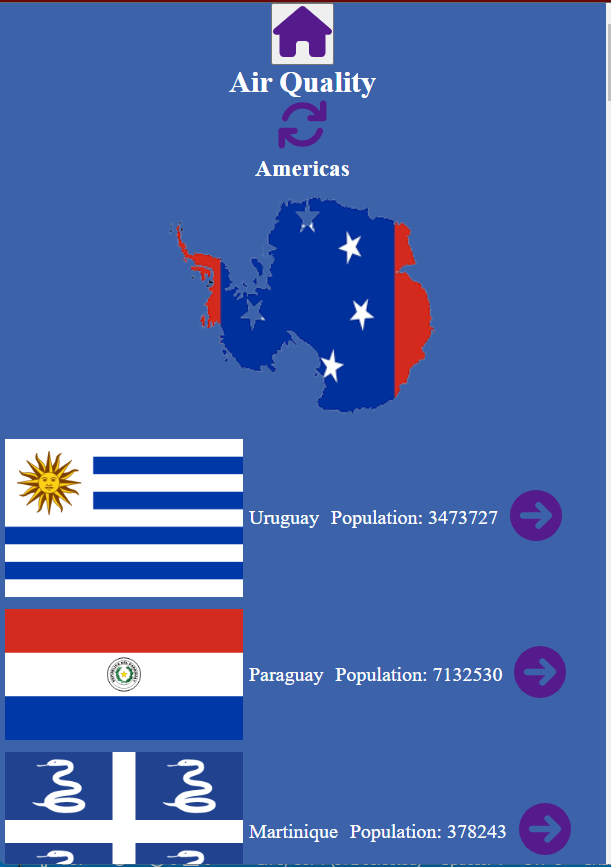
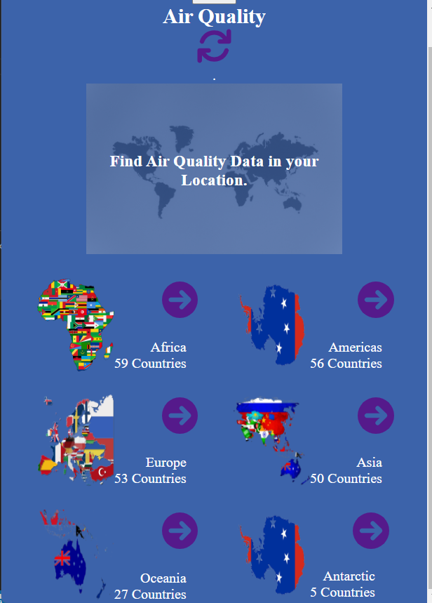

# React capstone project - Metrics webapp

In this React capstone project I built a mobile web application to check a list of metrics (numeric values) that a I created making use of React and Redux.

I selected an API that provides numeric data about Air Pollution across the globe and then built the webapp around it.  

## Built With
- React (A free and open-source front-end JavaScript library for building user interfaces based on UI components)
- Stylelint (A mighty, modern linter that helps you avoid errors and enforce conventions in your styles).
- ESlint (A mighty, modern linter that helps you avoid errors and enforce conventions in JavaScript codes)
- Redux
- GitFlow.
- NPM.

## Live Demo

[This is the link](https://626cdfa1459f1a418c99319c--stately-kashata-1db13f.netlify.app/) to the deployed web application.

### Prerequisites
The basic requirements for building the executable are:

- A working browser application (Google chrome, Mozilla Fire fox, Microsoft edge ...)
- VSCode or any other equivalent code editor
- Node Package Manager (For installing packages like Lighthous, webhint & stylelint used for checking for debugging bad codes before deployment)

## Getting Started

To get a local copy up and running follow these simple example steps.

### Prerequisites

You need nodejs and npm installed on your machine. If so, continue with the next steps.

### Setup

Install dependencies by running:

`npm install`

### Usage

Run live server by the following command:

`npm start`

### Run tests

`npm test`

### Deployment

To deploy this project run the following command:

`npm build`

and copy the content of `build` directory to the root folder of your production environment.

## Authors

👤 **Nicholas Mutale**

- GitHub: [@Mutalenic](https://github.com/Mutalenic)
- Twitter: [@bonke_gcobo](https://twitter.com/nicomutale)
- LinkedIn: [LinkedIn](https://linkedin.com/in/nicomutale)

## 🤝 Contributing

Contributions, issues, and feature requests are welcome!

## Show your support

Give a ⭐️ if you like this project!

## Acknowledgments

- Linters configuration are made by Microverse
- Design is inspired from a design made by [Nelson Sakwa](https://www.behance.net/sakwadesignstudio)

## LICENSE
This project is MIT licensed.